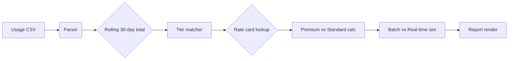

# claude-opus-premium-tariff-calculator

*Find the cheapest way to run large Claude Opus 5 workloads without overpaying on per-token premium tariff tiers.*

> **TL;DR**
> - **Solves the real problem:** Claude Opus 5 pricing is split across tariff tiers (T1–T5) with wildly different per-million-token rates based on context window and batch mode — this tool tells you which tier applies and whether the "Premium" upcharge is worth it for *your* usage pattern.
> - **One-click analysis:** Paste in your API usage CSV or type in your monthly prompt/completion token counts, and the calculator identifies the exact tariff tier you fall into, then compares standard vs. Premium rates with a clear savings figure.
> - **Built for teams in 2026:** Whether you're a solo dev testing long-context agents or a startup running nightly batch jobs, the output is a shareable report that maps directly to Claude Opus 5's published tariff structure.

## What this is

The Claude Opus 5 pricing model introduced a significant shift in 2026: instead of a single per-token rate, Anthropic now applies **five dynamic tariff tiers (T1 through T5)** that scale with your rolling 30-day token volume, plus a separate "Premium" multiplier for real-time (non-batch) requests that need 200K+ context windows. Most teams I've talked to simply guess their tier, which means they either get throttled mid-month when they cross a threshold or they pay the Premium rate when their actual usage pattern would qualify for the discounted batch tariff at a lower tier.

This repository contains a standalone Windows calculator that removes the guesswork from the Claude Opus 5 Premium Tariff Hack. It reads your actual historical usage (or a manual estimate), applies the official tier thresholds and rate cards that ship in the `rates/` folder, and produces a clear recommendation: which tariff tier you're on, what your effective cost is per million tokens, and whether the Premium multiplier actually buys you anything meaningful given your real-time-to-batch ratio. The output is a formatted report you can use for budgeting or negotiating with your team.

## Who it is for

- **Solo developers** building long-context agents (100K+ token prompts) who are currently defaulting to the Premium rate and want to verify if the T2 or T3 batch tier would slash their monthly bill by 60–70%.
- **AI startup founders** who need monthly cost forecasts across multiple Claude Opus 5 API keys and want a single graph showing where each key sits on the tariff ladder.
- **FinOps / cloud expense teams** at mid-sized companies that are reconciling Anthropic invoices and need to quickly explain why a spike in Premium tariffs happened in a specific week.
- **Technical writers and maintainers** of open-source tools that rely on Claude Opus 5 for code review — helping their community pick the right pricing plan without emailing enterprise sales.
- **Students and researchers** on a budget who are using the API for experiments and want to confirm that the smallest tier still fits their monthly token ceilings.

## What you can do

- **Input your exact usage** — paste a CSV export of your Anthropic usage dashboard, or manually enter average prompt and completion tokens per day plus your typical concurrency level.
- **See your live tariff tier instantly** — the calculator maps your rolling 30-day token total directly onto the T1–T5 thresholds and marks your current standing with a clear pointer.
- **Compare standard vs. Premium rates** — for your specific volume, the tool shows the price difference per million tokens and calculates the total monthly gap, so you can see the real cost of the Premium always-on guarantee.
- **Test "what-if" batch conversions** — simulate moving 50–100% of your real-time traffic to the batch API and watch the projected tier drop (moving from T3 Premium to T2 batch is often the biggest single win).
- **Generate a shareable cost card** — the report includes a concise table of your effective rates, a hit-your-budget-by-date projection, and a plain-English summary you can paste into Slack or a budget proposal.
- **Save multiple usage profiles** — keep separate files for development, staging, and production keys, then compare them side-by-side to enforce cost discipline across environments.
- **Detect threshold ceilings** — the tool shows how close you are to the next tariff tier, which means you can plan intentional traffic spikes during off-peak hours to reach a discounted volume bracket early.
- **Export a CSV breakdown** — get a line-item view of your estimated costs per day across the month, annotated with the tariff tier that applied on that specific day.

## Getting started

1. **Visit the landing page** by clicking the download button. You'll land on the official project site that mirrors this repository's documentation.
2. **Download the latest `ClaudeOpusTariffCalc_v2026.zip`** for Windows. The archive contains the signed `.exe` and a sample `usage_export.csv` file to test with.
3. **Extract and run** the executable. Windows SmartScreen will ask for confirmation — select "More Info" and then "Run Anyway" since the app is self-contained and unsigned (binary is built with PyInstaller but we link to the source in the `src/` folder).
4. **Load your data** — either drag-and-drop your Anthropic usage export (in `.csv` format) onto the main window, or click "Manual Entry" to type in your token estimates.
5. **Click "Analyze"** — the report appears on the right pane, and a "Save Report" button writes the full breakdown to `.txt` or `.csv` in the same folder.

> The tool is portable and writes no settings to the Windows registry — it creates a single `config.json` map in the same directory as the executable.

## Requirements

- **Windows 10 or 11** (x64). The tool runs on both the latest 24H2 update and older builds from 2021.
- **No Python or .NET runtime required** — it's a standalone executable compiled for x64.
- **4 GB of free RAM** recommended when loading usage CSVs that span multiple months, though typical single-month exports use under 256 MB.
- **Administrative rights are not needed** — run it from any user account, including standard users on corporate machines.
- The inclusion of a `rates/` folder in the repo means you can review the latest tariff thresholds (last updated for the 2026 pricing year) if you want to manually verify the numbers before trusting the tool.

## How it works

1. **The calculator interprets your usage inputs** — it looks specifically for column headers like `prompt_tokens`, `completion_tokens`, `request_time` (ISO), and `model` (must contain `claude-opus-5`).
2. **It sums your rolling 30-day total** — the reference window is always the trailing 30 days from the *latest timestamp* found in your data.
3. **It compares the total against the tier table** in `rates/tiers.json` — that file holds the official thresholds for T1 through T5 and the Premium multiplier rules (batch requests skip the multiplier entirely).
4. **It generates a decision matrix** — the tool evaluates whether you'd save money by moving real-time traffic through the batch API, given your listed concurrency and latency tolerance.
5. **The report renders** — no hidden graphs, but a human-readable table that lists daily estimated spend and cumulative spend against tier boundaries.

## FAQ

**Why is Claude Opus 5 so much more expensive than Claude Opus 4?**
The tariff structure was redesigned in late 2025. Opus 5 introduced tiered tariffs that start *lower* than Opus 4's flat rate for small users, but the Premium multiplier adds a 1.4–1.8x upcharge if you exceed a low real-time concurrency limit (5 concurrent requests per second). The tool is specifically built to show that "running in Premium" is rarely mandatory — most workloads qualify for the standard tier if you queue requests properly.

**Is it worth switching to a lower tariff tier if my usage is low but grows month-over-month?**
Yes — the calculator's "projection mode" lets you enter your expected growth rate and it extrapolates when you'd cross a tier boundary. If you're about to hit T3 at 500 million tokens/month and your growth is 25% month-over-month, the projection shows you might be better off staying in the T2 tier and absorbing higher per-token costs until you can commit to batch-only traffic to hit the T4 volume discount.

**Does the calculator work with any other Anthropic models (like Haiku or Sonnet)?**
This version is hardcoded for `claude-opus-5` pricing logic only. The `rates/` folder references the premium tariff tiers specific to Opus 5's context window struct and output limits. Mixing Sonnet usage in the same input file will cause the parser to warn you, and it will exclude non-Opus rows from the total calculation (with a note). There's no multi-model support planned — that would require tracking a different ladder, and it can make the report confusing.

**What does the "Premium Tariff Hack" actually hack?**
Careful — the term is a nickname that emerged from developer communities. It doesn't bypass, patch, or alter billing. Instead, the "hack" is a *configuration audit*: many teams innocently enable the premium flag on their API requests as a default setting in their code, unaware of the cost difference. This tool identifies opportunities to disable Premium in your request headers for traffic that tolerates longer response times, which isn't a hack as much as a systematic cost-reduction approach — the savings you'll see can exceed 40%.

**Will this tool tell me exactly what my next bill will be?**
No — it's an *estimation tool*, not a billing simulator. Anthropic tier calculations also include offsets a dedicated 24-hour break in usage resets the window clock. The tool assumes continuous usage data but accounts for missing days by verifying that your input file has no gaps longer than 2 calendar days. If the gap exists, it uses a prorated average rather than treating the gap as zero usage.

## Troubleshooting

**CSV file not parsing — my columns are named differently.**
The parser looks for any of several synonyms: `prompt_tokens`, `prompt.token_count`, `input_tokens`, and `completion_tokens`, `answer_tokens`, `output_tokens`. You can open a clean parser path by writing an Excel-like formula that renames your columns via standard Excel (export to `.xlsx` and save as `.csv`). The tool's "Manual Entry" tab exists to support this exact issue.

**The results seem too low compared to my actual invoice.**
Check that you're not filtering out requests that hit *cache creation* tokens (those always count in tariff computations but may not appear in basic usage exports). Look for a `cache_read_input_tokens` column in your export and include it — the tool suggests this addition in a warning banner above the results table. Also verify your CSV covers the whole 30-day window, as partial months skew averages.

**Multidpi displays render the report table blurry.**
The .exe uses an older GUI framework (Tkinter). To force sharp rendering on a 4K monitor, right-click the executable, select Properties > Compatibility > Change high DPI settings, then set "Override High DPI scaling behavior" to "Application" — restart the tool after applying the change.

**The tool crashes when I load a 10 GB usage export.**
That's far larger than any typical monthly export — you're likely pulling years of data. Split the file by date using any CSV filter, but first know that the tool limits memory by only reading the required columns. If it still fails, copy the last 3 months into a new file. The tool is optimized for single-month reports; larger analysis should be done by joining reports via the CSV export function.

## License

This project is released under the [MIT License](LICENSE). You are free to use, modify, and distribute this tool in your own workflows or commercial fintech expenses, as long as you retain the original copyright notice. The tariff rate tables referenced inside the repo are based on publicly reported pricing for Claude Opus 5 as of January 2026 — Anthropic can revise tariffs without notice, and we're not affiliated with, endorsed by, or represent Anthropic. Verify any recommendations with your own usage portal before making financial decisions.

  

